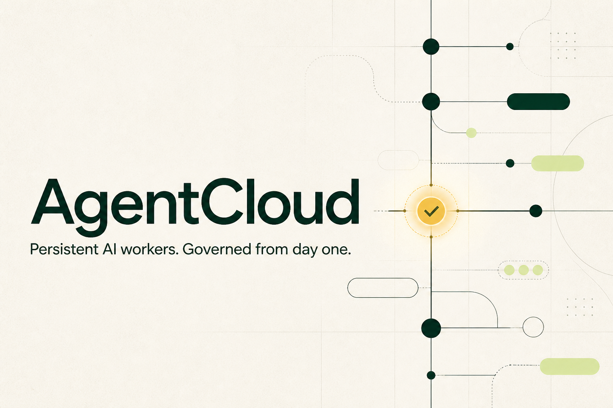

<div align="center">
  
</div>

# AgentCloud

**A control plane for persistent AI workers.** Turn an objective into a versioned worker, test it without writes, deploy it to a durable runtime, require human approval for sensitive actions, and inspect every decision in one timeline.

[](https://github.com/premhiru/agentcloud/actions/workflows/ci.yml)


[Project overview](https://agentcloud-control-plane.premhiru.chatgpt.site) · [Interactive demo](https://agentcloud-control-plane.premhiru.chatgpt.site/demo) · [Architecture](./ARCHITECTURE.md) · [Security](./SECURITY.md) · [Deployment](./DEPLOYMENT.md) · [Implementation plan](./PLAN.md)

> [!TIP]
> The complete demo is deterministic and credential-free. It uses fake model, Gmail, HubSpot, Slack, and runtime adapters while exercising the same policy, approval, idempotency, and persistence boundaries as production.

## What AgentCloud does

Most agent demos end when the chat closes. AgentCloud treats an AI worker as a durable, governed software artifact:

| Capability | What it means |
| --- | --- |
| **Versioned workers** | Every deployment pins an immutable `WorkerSpec`; new changes create a new version. |
| **Explicit authority** | Unknown and ungranted capabilities are denied by default. |
| **Safe testing** | Dry-runs execute reads against deterministic fixtures and convert every write into a “would execute” event. |
| **Human approval** | Sensitive actions pause with a redacted preview and resume the exact run after a decision. |
| **Durable execution** | Runs, checkpoints, approvals, schedules, and audit events persist independently of the initiating conversation. |
| **Exactly-once intent** | Stable idempotency keys prevent duplicate side effects during retries and approval resumes. |
| **Tenant isolation** | Every tenant-owned operation is scoped to an organization at the repository and service boundaries. |
| **One lifecycle, two surfaces** | The dashboard and authenticated MCP expose the same create, test, deploy, run, approve, pause, resume, version, and rollback lifecycle. |

## Quickstart

### Requirements

- Node.js 24 or later
- pnpm 11

### Install and run

```bash
git clone https://github.com/premhiru/agentcloud.git
cd agentcloud
pnpm install
cp .env.example .env.local
pnpm dev
```

On PowerShell, replace the copy command with:

```powershell
Copy-Item .env.example .env.local
```

Open [http://localhost:3000](http://localhost:3000). The checked-in environment template already enables the safe demo adapters, so no database or vendor credentials are required.

Demo state is persisted in `.agentcloud/demo-store.json`. Demo mode is explicit and is never used as a production fallback.

## Run the canonical worker

The included **Inbound Sales Worker** demonstrates the complete governed lifecycle:

1. Open **Workers** and select **Inbound Sales Guardian**.
2. Choose **Test safely**. AgentCloud reads deterministic lead fixtures and records proposed writes without executing them.
3. Deploy the worker, then choose **Run now**.
4. The run qualifies the lead, updates the fake CRM once, drafts outreach, and pauses before sending email.
5. Open **Approvals**, inspect the exact redacted action, then choose **Approve and view run**.
6. The same run resumes from its checkpoint, sends exactly one fake email, posts one fake Slack notification, and finishes with a complete timeline.
7. Pause or resume the deployment, create a new version, deploy it, and roll back to a previous immutable version.

The same sequence is covered through the AgentCloud MCP, including reconnecting from a new client after the initiating client has closed.

## How it works

```text
Dashboard · MCP · Signed webhooks
                │
                ▼
      AgentCloud control plane
                │
     ┌──────────┼──────────┐
     ▼          ▼          ▼
 WorkerSpec   Policy     Budgets
 versions     engine     and usage
     │          │          │
     └──────────┼──────────┘
                ▼
        Governed worker runner
                │
      ┌─────────┴─────────┐
      ▼                   ▼
 WorkerRuntime     IntegrationAdapter
 Fake / Trigger.dev  Fake / Composio
                │
                ▼
 PostgreSQL · approvals · timelines · audit
```

AgentCloud keeps vendor-specific code behind narrow interfaces:

| Boundary | Deterministic implementation | Production implementation |
| --- | --- | --- |
| `ModelProvider` | Fixed compiler and worker outputs | AI SDK with OpenAI |
| `WorkerRuntime` | In-process durable fake runtime | Trigger.dev v4 |
| `IntegrationAdapter` | Gmail, HubSpot, and Slack fixtures | Composio connected accounts |
| Persistence | Durable demo JSON / in-memory test repositories | PostgreSQL with Drizzle ORM |
| Identity | Explicit demo tenant | Clerk users and organizations |

This separation keeps the core lifecycle portable and makes CI deterministic.

## WorkerSpec and authority

A worker deployment references an immutable `WorkerSpec` version. The spec defines identity, triggers, authority, budgets, memory policy, and runtime behavior without embedding credentials. This excerpt shows the authority and budget shape:

```yaml
schemaVersion: "1.0"
identity:
  name: Inbound Sales Guardian
capabilities:
  - capability: gmail.search_messages
  - capability: hubspot.upsert_contact
  - capability: gmail.send_email
authority:
  defaultEffect: deny
  rules:
    - capability: gmail.search_messages
      effect: allow
    - capability: hubspot.upsert_contact
      effect: allow
    - capability: gmail.send_email
      effect: require_approval
budget:
  monthlyUsd: 50
  perRunUsd: 1
  maxModelCallsPerRun: 12
  maxToolCallsPerRun: 30
```

The policy engine evaluates every tool call against the pinned spec. Missing capabilities, invalid inputs, exceeded budgets, and unknown operations fail closed.

## Safety model

Safety is enforced in application code and persistence—not delegated to the model prompt.

| Invariant | Enforcement |
| --- | --- |
| Default deny | Only capabilities in the curated registry and active WorkerSpec may execute. |
| Dry-run write suppression | Write capabilities return structured previews before any adapter call. |
| Approval integrity | Each approval is bound to a canonical hash of the exact capability and input. |
| Resume integrity | Approved runs continue from a serialized checkpoint without replaying earlier work. |
| Duplicate prevention | Tool executions are unique by run and model tool-call ID; successful results are replayed. |
| Unknown outcomes | Ambiguous write failures stop for manual reconciliation instead of retrying blindly. |
| Tenant isolation | Organization IDs are mandatory across repositories, control-plane operations, MCP, and routes. |
| Secret hygiene | Credentials never enter WorkerSpecs, browser bundles, logs, audit events, MCP output, or approval previews. |

See [SECURITY.md](./SECURITY.md) for the complete threat model and security invariants.

## MCP

AgentCloud exposes a Streamable HTTP MCP endpoint at:

```text
https://YOUR_DOMAIN/api/mcp
```

Production MCP authentication uses Clerk OAuth metadata and organization membership. Each tool rechecks its required scope server-side.

Available lifecycle tools include:

```text
create_worker       update_worker       test_worker
deploy_worker       trigger_worker      cancel_run
get_run             list_runs           list_approvals
approve_action      reject_action       pause_worker
resume_worker       list_worker_versions rollback_worker
get_usage           list_connections    delete_worker
```

OAuth scopes:

```text
workers:read        workers:write       workers:deploy
runs:read           approvals:read      approvals:write
connections:read
```

The protocol tests use the official MCP client in-process, enforce authentication and scopes, and verify that a second client can recover persisted workers and runs.

## Webhooks

Workers can expose signed webhook triggers at:

```text
POST /api/webhooks/workers/{workerId}/{triggerKey}
```

Requests require:

- `X-AgentCloud-Signature: sha256=<hex>` computed from the raw body with `WEBHOOK_SIGNING_SECRET`
- A stable `Idempotency-Key`
- A body no larger than 256 KiB

Webhook requests are rate-limited, structurally validated, tenant-scoped, and deduplicated. Reusing an idempotency key with a different payload is rejected.

## Configuration

AgentCloud has two explicit operating modes:

| Mode | Required setup | Behavior |
| --- | --- | --- |
| **Demo** | `DEMO_MODE=true` and `NEXT_PUBLIC_DEMO_MODE=true` | Durable local demo with deterministic adapters and no external writes. |
| **Production** | PostgreSQL, Clerk, OpenAI, Trigger.dev, Composio, and application secrets | Real adapters are selected explicitly; missing configuration fails closed. |

Start with [.env.example](./.env.example), which documents every variable and its safe default. Never expose server secrets through `NEXT_PUBLIC_*` variables.

## Development

```bash
pnpm dev               # Next.js development server
pnpm lint              # ESLint with zero warnings
pnpm typecheck         # strict TypeScript
pnpm test              # full Vitest suite
pnpm test:unit         # domain and adapter tests
pnpm test:integration  # persistence and lifecycle tests
pnpm test:security     # product safety invariants
pnpm test:mcp          # authenticated MCP lifecycle
pnpm test:e2e          # critical Playwright journeys
pnpm build             # optimized production build
pnpm db:migrate        # apply committed migrations
pnpm db:seed           # seed a local tenant
pnpm trigger:dev       # Trigger.dev local task runner
pnpm trigger:deploy    # deploy Trigger.dev tasks
```

### Validation contract

CI runs the following against Node.js 24, pnpm 11, and PostgreSQL 16:

```bash
pnpm install --frozen-lockfile
pnpm db:migrate
pnpm lint
pnpm typecheck
pnpm test
pnpm build
pnpm test:e2e
```

The test matrix covers unit, integration, tenant-isolation, dry-run safety, approval pause/resume, duplicate-side-effect, MCP lifecycle, signed webhook, production persistence, and critical browser flows.

## Repository guide

```text
src/
  application/       control plane and durable demo store
  domain/            WorkerSpec, versions, policy, budgets
  runtime/           governed runner and runtime adapters
  integrations/      tool registry and integration adapters
  approvals/         approval hashing, decisions, and waitpoints
  persistence/       PostgreSQL repositories and audit records
  mcp/               authenticated MCP server and tool service
  app/               dashboard, API, MCP, and webhook routes
tests/
  unit/              domain contracts
  integration/       persistence and lifecycle boundaries
  security/          non-negotiable product invariants
  mcp/               protocol-level lifecycle tests
  e2e/               Playwright user journeys
trigger/              Trigger.dev durable task entrypoint
agentcloud-site/      companion product site
```

## Production deployment

Deploy the web application and runtime from the same Git revision:

1. Provision PostgreSQL or Neon and run the committed migrations.
2. Configure Clerk Organizations and MCP OAuth scopes.
3. Configure Trigger.dev and deploy the worker task.
4. Create Composio Gmail, HubSpot, and Slack auth configurations.
5. Configure OpenAI, the application URL, and webhook signing secret.
6. Deploy the Next.js application to Vercel, then run the operational checks.

The exact release order, smoke tests, rollback procedure, and credential-dependent checks are in [DEPLOYMENT.md](./DEPLOYMENT.md).

> [!IMPORTANT]
> This repository verifies production code paths with deterministic adapters. It does not claim successful vendor OAuth consent, Trigger.dev Cloud execution, Vercel deployment, or real third-party writes without operator-owned credentials.

## Project status

The credential-independent MVP and all milestones in [PLAN.md](./PLAN.md) are complete. [PROGRESS.md](./PROGRESS.md) records the implemented behavior and verification evidence for each milestone.

Real Gmail, HubSpot, Slack, Clerk OAuth, Trigger.dev Cloud, OpenAI, and Vercel checks remain operator-credentialed deployment steps. The product intentionally does not expose financial, destructive, bulk, arbitrary MCP, browser, shell, or user-code tools.

## Documentation

- [ARCHITECTURE.md](./ARCHITECTURE.md) — boundaries, core contracts, persistence, and runtime independence
- [SECURITY.md](./SECURITY.md) — threat model, tenant isolation, approvals, side effects, and vulnerability reporting
- [DEPLOYMENT.md](./DEPLOYMENT.md) — production provisioning, release, verification, and rollback
- [docs/MCP_REGISTRY.md](./docs/MCP_REGISTRY.md) — remote MCP OAuth gates and guarded Registry publication
- [docs/LAUNCH_KIT.md](./docs/LAUNCH_KIT.md) — positioning, launch copy, and the verified 75-second demo script
- [CONTRIBUTING.md](./CONTRIBUTING.md) — development workflow, safety guardrails, and test expectations
- [PLAN.md](./PLAN.md) — product thesis, technical design, milestones, and Definition of Done
- [PROGRESS.md](./PROGRESS.md) — milestone checkpoints and exact verification history
- [.env.example](./.env.example) — complete configuration contract

## Security

Do not open a public issue containing a vulnerability, credential, customer data, or unredacted action payload. Follow the private reporting guidance in [SECURITY.md](./SECURITY.md).

## License

AgentCloud is available under the [Apache License 2.0](./LICENSE).
