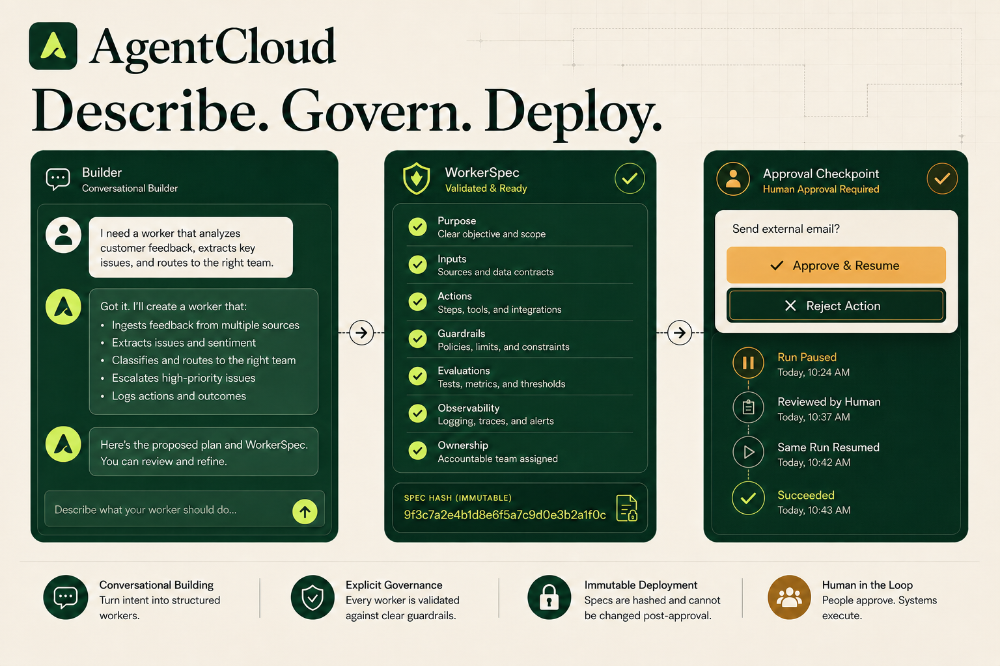

<div align="center">
  
</div>

# AgentCloud

**A control plane for persistent AI workers.** Describe a job conversationally, simulate it without writes, govern its authority, deploy an immutable version, and keep improving it from observable run history.

[](https://github.com/premhiru/agentcloud/actions/workflows/ci.yml)


[Project overview](https://agentcloud-control-plane.premhiru.chatgpt.site) · [Guided browser demo](https://agentcloud-control-plane.premhiru.chatgpt.site/demo) · [Architecture](./ARCHITECTURE.md) · [Security](./SECURITY.md) · [Deployment](./DEPLOYMENT.md) · [Implementation plan](./PLAN.md)

> [!TIP]
> The repository's demo mode is deterministic and credential-free. It uses fake model, Gmail, HubSpot, Slack, and runtime adapters while exercising the same policy, approval, idempotency, and application boundaries as production. The public guided demo is a device-local browser simulation; both persistence boundaries are documented below.

When running the authenticated app under `next dev` without `OPENAI_API_KEY`, AgentCloud uses the deterministic compiler only for local proposal design and labels that mode in the UI. This development convenience never activates in production or tests; production continues to fail closed when the model credential is absent.

## What AgentCloud does

Most agent demos end when the chat closes. AgentCloud treats an AI worker as a durable, governed software artifact:

| Capability | What it means |
| --- | --- |
| **Conversational builder** | Start from an outcome, refine it turn by turn, and review the exact spec diff, readiness checks, connections, and immutable hash before saving. |
| **Versioned workers** | Every deployment pins an immutable `WorkerSpec`; new changes create a new version. |
| **Explicit authority** | Unknown and ungranted capabilities are denied by default. |
| **Safe testing** | Dry-runs execute reads against deterministic fixtures and convert every write into a “would execute” event. |
| **Human approval** | Sensitive actions pause with a redacted preview and resume the exact run after a decision. |
| **Durable execution** | Runs, checkpoints, approvals, schedules, and audit events persist independently of the initiating conversation. |
| **Exactly-once intent** | Stable idempotency keys prevent duplicate side effects during retries and approval resumes. |
| **Tenant isolation** | Every tenant-owned operation is scoped to an organization at the repository and service boundaries. |
| **One lifecycle, two surfaces** | The dashboard and authenticated MCP expose the same build, test, deploy, run, approve, refine, and rollback lifecycle. |

## From description to operation

AgentCloud uses one deliberate loop in the dashboard and MCP:

1. **Describe** — state the job and up to 20 explicit constraints in plain language.
2. **Simulate safely** — run the actual reasoning path while every write becomes a reviewable “would execute” event.
3. **Govern** — inspect registered capabilities, default-deny authority, approval rules, budgets, missing connections, and unresolved questions.
4. **Deploy immutably** — save the exact reviewed proposal as a hashed WorkerSpec version, then explicitly deploy it. Saving never deploys implicitly.
5. **Observe and approve** — follow the run timeline; approval-required actions pause with a redacted preview and resume the same checkpoint after a decision.
6. **Refine or roll back** — branch a new builder session from the latest immutable version, review the diff, deploy it when ready, or reactivate a historical version.

Builder turns are proposals, not mutable deployed specs. Each refinement requires the current revision number, and each commit binds to the reviewed 64-character spec hash. Concurrent or stale edits fail with a revision conflict instead of overwriting another change.

## Quickstart

### Requirements

- Node.js 24 or later
- pnpm 11

### Install and run

```bash
git clone https://github.com/premhiru/agentcloud.git
cd agentcloud
pnpm install
cp .env.example .env.local
pnpm dev
```

On PowerShell, replace the copy command with:

```powershell
Copy-Item .env.example .env.local
```

Open [http://localhost:3000](http://localhost:3000). The checked-in environment template already enables the safe demo adapters, so no database or vendor credentials are required.

Committed demo workers, versions, runs, approvals, and audit events persist in `.agentcloud/demo-store.json`. Open builder conversations use an in-process deterministic repository: they survive MCP client disconnects while the same application process is running, but not a process restart. Production builder sessions and proposals persist in PostgreSQL. Demo mode is explicit and is never used as a production fallback.

## Run the canonical worker

The included **Inbound Sales Worker** demonstrates the complete governed lifecycle:

1. Choose **Create worker**, describe the inbound-sales outcome, and refine the proposal while reviewing its capabilities, readiness, and diff.
2. Save the reviewed proposal as an immutable version, or open the included **Inbound Sales Guardian**.
3. Choose **Test safely**. AgentCloud reads deterministic lead fixtures and records proposed writes without executing them.
4. Deploy the worker, then choose **Run now**.
5. The run qualifies the lead, updates the fake CRM once, drafts outreach, and pauses before sending email.
6. Open **Approvals**, inspect the exact redacted action, then choose **Approve and view run**.
7. The same run resumes from its checkpoint, sends exactly one fake email, posts one fake Slack notification, and finishes with a complete timeline.
8. Pause or resume the deployment, refine it into a new version, deploy it, and roll back to a previous immutable version.

The same sequence is covered through the AgentCloud MCP, including reconnecting from a new client after the initiating client has closed.

## How it works

```text
Dashboard · MCP · Signed webhooks
                │
                ▼
      AgentCloud control plane
                │
     ┌──────────┼──────────┬──────────┐
     ▼          ▼          ▼          ▼
  Builder   WorkerSpec   Policy     Budgets
 proposals   versions     engine     and usage
     │          │          │
     └──────────┼──────────┘
                ▼
        Governed worker runner
                │
      ┌─────────┴─────────┐
      ▼                   ▼
 WorkerRuntime       IntegrationAdapter
 Fake / Trigger.dev  Fake / Official MCP / managed fallback
                │
                ▼
 PostgreSQL · approvals · timelines · audit
```

AgentCloud keeps vendor-specific code behind narrow interfaces:

| Boundary | Deterministic implementation | Production implementation |
| --- | --- | --- |
| `ModelProvider` | Fixed compiler and worker outputs | AI SDK with OpenAI |
| `WorkerRuntime` | In-process durable fake runtime | Trigger.dev v4 |
| `IntegrationAdapter` | Gmail, HubSpot, and Slack fixtures | Capability-routed official remote MCP plus managed OAuth fallback |
| Persistence | Durable demo JSON for committed lifecycle state; in-process open builder sessions | PostgreSQL with Drizzle ORM for builder and lifecycle state |
| Identity | Explicit demo tenant | Clerk users and organizations |

This separation keeps the core lifecycle portable and makes CI deterministic.

## WorkerSpec and authority

A worker deployment references an immutable `WorkerSpec` version. The spec defines identity, triggers, authority, budgets, memory policy, and runtime behavior without embedding credentials. This excerpt shows the authority and budget shape:

```yaml
schemaVersion: "1.0"
identity:
  name: Inbound Sales Guardian
capabilities:
  - capability: gmail.search_messages
  - capability: hubspot.upsert_contact
  - capability: gmail.send_email
authority:
  defaultEffect: deny
  rules:
    - capability: gmail.search_messages
      effect: allow
    - capability: hubspot.upsert_contact
      effect: allow
    - capability: gmail.send_email
      effect: require_approval
budget:
  monthlyUsd: 50
  perRunUsd: 1
  maxModelCallsPerRun: 12
  maxToolCallsPerRun: 30
```

The policy engine evaluates every tool call against the pinned spec. Missing capabilities, invalid inputs, exceeded budgets, and unknown operations fail closed.

## Supported capabilities and limits

The current registry is intentionally small. The builder may select only these abstract AgentCloud capability IDs:

| Provider | Read capabilities | Write or communication capabilities |
| --- | --- | --- |
| Gmail | `gmail.search_messages`, `gmail.read_message` | `gmail.send_email` — high risk and approval-required by the compiler |
| HubSpot | `hubspot.search_contacts`, `hubspot.get_contact` | `hubspot.upsert_contact`, `hubspot.create_note` |
| Slack | `slack.list_channels` | `slack.post_message` — external communication governed by the reviewed authority rule |

Production connections are capability-aware. AgentCloud prefers each provider's fixed official remote MCP endpoint, discovers its advertised tools after OAuth, and exposes only the intersection with the curated registry above. It does not turn arbitrary discovered MCP tools into worker authority. Current official coverage is incomplete: Gmail MCP can search/read but cannot send email, and Slack MCP does not provide AgentCloud's bounded channel-list capability, so those gaps remain on the managed OAuth adapter. HubSpot and Slack message posting prefer official MCP when configured. A worker is deployment-ready only when every exact granted capability has an active route.

Builder inputs are bounded to a 10–2,000 character objective, at most 20 initial constraints of 500 characters each, and 500 characters per refinement. WorkerSpec 1.0 allows at most 50 instructions, 10 triggers, 50 capability grants, and 100 authority rules. Individual capability inputs are validated against registry-owned Zod schemas before policy evaluation or adapter execution.

The MVP does **not** expose financial actions, destructive actions, bulk sending, arbitrary vendor or MCP tools, browser control, shell access, or user-supplied code execution. Unsupported requests remain visible as readiness blockers; the compiler cannot invent a tool to satisfy them.

## Safety model

Safety is enforced in application code and persistence—not delegated to the model prompt.

| Invariant | Enforcement |
| --- | --- |
| Default deny | Only capabilities in the curated registry and active WorkerSpec may execute. |
| Dry-run write suppression | Write capabilities return structured previews before any adapter call. |
| Approval integrity | Each approval is bound to a canonical hash of the exact capability and input. |
| Resume integrity | Approved runs continue from a serialized checkpoint without replaying earlier work. |
| Duplicate prevention | Tool executions are unique by run and model tool-call ID; successful results are replayed. |
| Unknown outcomes | Ambiguous write failures stop for manual reconciliation instead of retrying blindly. |
| Tenant isolation | Organization IDs are mandatory across repositories, control-plane operations, MCP, and routes. |
| Secret hygiene | Credentials never enter WorkerSpecs, browser bundles, logs, audit events, MCP output, or approval previews. |

See [SECURITY.md](./SECURITY.md) for the complete threat model and security invariants.

## MCP

AgentCloud exposes a Streamable HTTP MCP endpoint at:

```text
https://YOUR_DOMAIN/api/mcp
```

Production MCP authentication uses Clerk OAuth metadata and organization membership. Each tool rechecks its required scope server-side.

Available lifecycle tools include:

```text
start_worker_builder get_worker_builder    refine_worker_builder
commit_worker_builder abandon_worker_builder create_worker
update_worker         get_worker            list_workers
test_worker           deploy_worker         trigger_worker
cancel_run            get_run               list_runs
list_approvals        approve_action        reject_action
pause_worker          resume_worker         list_worker_versions
rollback_worker       get_usage             list_connections
connect_tool          delete_worker
```

The builder tools support a reviewable multi-turn flow:

```text
start_worker_builder   objective + optional constraints, or an existing workerId
get_worker_builder     sessionId
refine_worker_builder  sessionId + expectedRevision + message
commit_worker_builder  sessionId + expectedRevision + expectedSpecHash
abandon_worker_builder sessionId + expectedRevision
```

`commit_worker_builder` saves an immutable DRAFT or READY version; it never deploys. `create_worker` and `update_worker` remain one-call compatibility tools backed by the same builder validation and immutable commit path. Builder responses include safe proposal history, readiness, diffs, missing connections, and stable dashboard paths. Absolute continuation URLs are included only when `APP_BASE_URL` is a valid HTTPS origin, or localhost HTTP during development.

OAuth scopes:

```text
workers:read        workers:write       workers:deploy
runs:read           approvals:read      approvals:write
connections:read
```

| Scope | Tool groups |
| --- | --- |
| `workers:read` | Inspect builders/workers and list immutable versions. |
| `workers:write` | Start/refine/commit/abandon builders; create/update workers; start safe tests or live runs; cancel/archive. |
| `workers:deploy` | Deploy, pause, resume, and roll back workers. |
| `runs:read` | Inspect/list runs and estimated usage. |
| `approvals:read`, `approvals:write` | Inspect and decide approval requests. |
| `connections:read` | Inspect connections or start a provider-managed connection flow. |

The protocol tests use the official MCP client in-process, enforce authentication and scopes, and verify that a second client can recover a builder session, committed worker, and run. In production, the OAuth token determines the Clerk user and AgentCloud resolves the organization from server-side membership; tool arguments cannot select a tenant.

## Webhooks

Workers can expose signed webhook triggers at:

```text
POST /api/webhooks/workers/{workerId}/{triggerKey}
```

Requests require:

- `X-AgentCloud-Signature: sha256=<hex>` computed from the raw body with `WEBHOOK_SIGNING_SECRET`
- A stable `Idempotency-Key`
- A body no larger than 256 KiB

Webhook requests are rate-limited, structurally validated, tenant-scoped, and deduplicated. Reusing an idempotency key with a different payload is rejected.

## Configuration

AgentCloud has two explicit operating modes:

| Mode | Required setup | Behavior |
| --- | --- | --- |
| **Demo** | `DEMO_MODE=true` and `NEXT_PUBLIC_DEMO_MODE=true` | Deterministic compiler, Gmail/HubSpot/Slack fixtures, fake runtime, durable committed lifecycle JSON, and in-process open builder sessions. No external vendor call is made. |
| **Production** | PostgreSQL, Clerk, OpenAI, Trigger.dev, official provider MCP OAuth, optional managed fallback, and application secrets | PostgreSQL-persisted builder/lifecycle state and explicitly selected real adapters; missing capability coverage fails closed. |

Start with [.env.example](./.env.example), which documents every variable and its safe default. Never expose server secrets through `NEXT_PUBLIC_*` variables.

## Development

```bash
pnpm dev               # Next.js development server
pnpm lint              # ESLint with zero warnings
pnpm typecheck         # strict TypeScript
pnpm test              # full Vitest suite
pnpm test:unit         # domain and adapter tests
pnpm test:integration  # persistence and lifecycle tests
pnpm test:security     # product safety invariants
pnpm test:mcp          # authenticated MCP lifecycle
pnpm test:e2e          # critical Playwright journeys
pnpm build             # optimized production build
pnpm db:migrate        # apply committed migrations
pnpm db:seed           # seed a local tenant
pnpm trigger:dev       # Trigger.dev local task runner
pnpm trigger:deploy    # deploy Trigger.dev tasks
```

### Validation contract

CI runs the following against Node.js 24, pnpm 11, and PostgreSQL 16:

```bash
pnpm install --frozen-lockfile
pnpm db:migrate
pnpm lint
pnpm typecheck
pnpm test
pnpm build
pnpm test:e2e
```

The test matrix covers unit, integration, tenant-isolation, dry-run safety, approval pause/resume, duplicate-side-effect, MCP lifecycle, signed webhook, production persistence, and critical browser flows.

## Repository guide

```text
src/
  application/       conversational builder, compiler, control plane, and demo store
  domain/            WorkerSpec, versions, policy, budgets
  runtime/           governed runner and runtime adapters
  integrations/      tool registry and integration adapters
  approvals/         approval hashing, decisions, and waitpoints
  persistence/       PostgreSQL repositories and audit records
  mcp/               authenticated MCP server and tool service
  app/               dashboard, API, MCP, and webhook routes
tests/
  unit/              domain contracts
  integration/       persistence and lifecycle boundaries
  security/          non-negotiable product invariants
  mcp/               protocol-level lifecycle tests
  e2e/               Playwright user journeys
trigger/              Trigger.dev durable task entrypoint
agentcloud-site/      companion product site
```

## Production deployment

Deploy the web application and runtime from the same Git revision:

1. Provision PostgreSQL or Neon and run the committed migrations.
2. Configure Clerk Organizations and MCP OAuth scopes.
3. Configure Trigger.dev and deploy the worker task.
4. Register OAuth clients for the official Gmail, HubSpot, and Slack remote MCP servers, and configure managed OAuth only for capability gaps.
5. Configure OpenAI, the application URL, and webhook signing secret.
6. Deploy the Next.js application to Vercel, then verify the builder-to-approval lifecycle with operator-owned accounts.

The exact release order, smoke tests, rollback procedure, and credential-dependent checks are in [DEPLOYMENT.md](./DEPLOYMENT.md).

> [!IMPORTANT]
> This repository verifies production code paths with deterministic adapters. It does not claim successful vendor OAuth consent, Trigger.dev Cloud execution, Vercel deployment, or real third-party writes without operator-owned credentials.

## Project status

The credential-independent MVP and all milestones in [PLAN.md](./PLAN.md) are complete. [PROGRESS.md](./PROGRESS.md) records the implemented behavior and verification evidence for each milestone.

Real Gmail, HubSpot, Slack remote-MCP OAuth/tool-schema checks, managed-fallback execution, Clerk OAuth, Trigger.dev Cloud, OpenAI, and Vercel checks remain operator-credentialed deployment steps. The deterministic demo proves AgentCloud’s control-plane behavior; it is not evidence of live vendor consent, third-party writes, or a public production deployment.

## Documentation

- [ARCHITECTURE.md](./ARCHITECTURE.md) — boundaries, core contracts, persistence, and runtime independence
- [SECURITY.md](./SECURITY.md) — threat model, tenant isolation, approvals, side effects, and vulnerability reporting
- [DEPLOYMENT.md](./DEPLOYMENT.md) — production provisioning, release, verification, and rollback
- [docs/MCP_REGISTRY.md](./docs/MCP_REGISTRY.md) — remote MCP OAuth gates and guarded Registry publication
- [docs/LAUNCH_KIT.md](./docs/LAUNCH_KIT.md) — positioning, launch copy, and the governed 90-second demo script
- [CONTRIBUTING.md](./CONTRIBUTING.md) — development workflow, safety guardrails, and test expectations
- [PLAN.md](./PLAN.md) — product thesis, technical design, milestones, and Definition of Done
- [PROGRESS.md](./PROGRESS.md) — milestone checkpoints and exact verification history
- [.env.example](./.env.example) — complete configuration contract

## Security

Do not open a public issue containing a vulnerability, credential, customer data, or unredacted action payload. Follow the private reporting guidance in [SECURITY.md](./SECURITY.md).

## License

AgentCloud is available under the [Apache License 2.0](./LICENSE).
